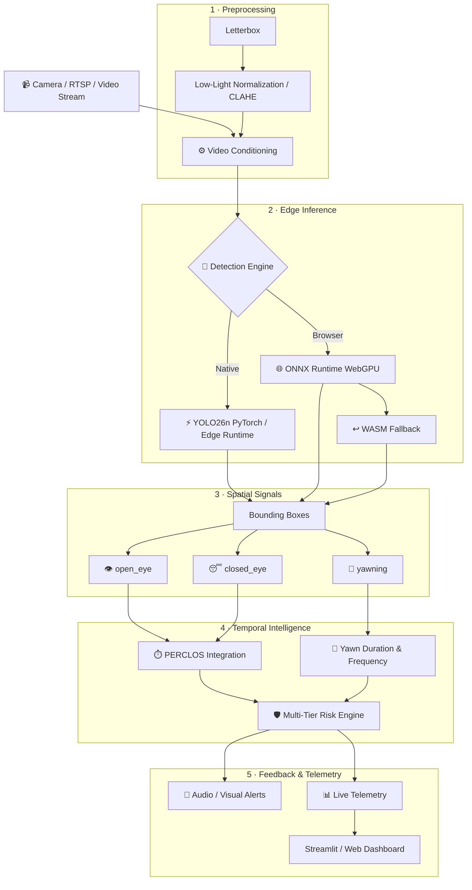

<div align="center">

# 🚘 SentryEye
### AI-Powered Driver Safety & Assistance System (ADAS)
**Real-time edge AI for driver drowsiness, distraction, and fatigue-risk detection**

<p>
  <a href="https://sharp-gaze-platform.lovable.app">
    
  </a>
  <a href="https://dashboard-grad-project.vercel.app">
    
  </a>
  <a href="https://github.com/markegyptian55-cloud/AI-Based-Driver-Safety-And-Assistance-System">
    
  </a>
</p>

<p>
  
  
  
  
  
</p>

<p>
  
  
  
  
  
  
</p>

> **Production Winner:** **YOLO26n @ 640×640** — **81.02% test mAP@50**, **47.0 FPS on GPU** (batch-1, forward-pass), and **~5.14 MB deployable footprint**. Selected for the optimal size ↔ speed ↔ accuracy balance rather than chasing isolated leaderboard scores.

<p>
  <b>🎯 Computer Vision</b> ·
  <b>⚡ Edge AI</b> ·
  <b>🧠 Deep Learning</b> ·
  <b>📹 Driver Monitoring</b> ·
  <b>🛡️ ADAS</b>
</p>

</div>

---

## ✨ What Is SentryEye?

**SentryEye** is an end-to-end driver monitoring and safety system designed to detect visual fatigue signals in real time and convert frame-level computer-vision detections into temporal risk intelligence.

Instead of treating every frame in isolation, the system combines:

* 👁️ **Eye-state detection:** High-frequency classification of `open_eye` vs. `closed_eye`.
* 🥱 **Yawn detection:** Precise localization of active `yawning` episodes.
* ⏱️ **Temporal fatigue analysis:** Algorithmic PERCLOS integration and yawn duration/frequency evaluation.
* 🛡️ **Risk scoring:** Multi-tiered driver-threat decision engine.
* 🚨 **Real-time alerts:** Sub-millisecond acoustic and visual feedback loop.
* ⚡ **Edge deployment:** Native accelerated Python execution alongside browser-side WebGPU/WASM pipelines.

Developed through an empirical research trajectory across 21+ model experiments, SentryEye optimizes the multidimensional **accuracy ↔ latency ↔ footprint** trade-off for resource-constrained automotive edge hardware.

---

## 🧭 Quick Navigation

| Section | Description |
| :--- | :--- |
| [🎯 Product Overview](#-what-is-sentryeye) | Motivation, core capabilities, and scope |
| [🌐 Live Ecosystem](#-live-ecosystem) | Direct links to shipped applications and datasets |
| [🏗️ System Architecture](#-system-architecture) | End-to-end perception and temporal analysis pipeline |
| [📊 Pareto Frontier Benchmarks](#-pareto-frontier-benchmarks) | Measured tradeoffs, charts, and hardware benchmarks |
| [📋 Full Results Ledger](#-full-results-ledger) | Complete 23-run benchmark across all architectures |
| [🔬 Research Journey](#-21-experiment-research-journey) | Three-phase experimental progression |
| [🗄️ Certified Dataset](#-certified-dataset) | Distribution, audit metrics, and splits |
| [📈 Evaluation Pipeline](#-evaluation--validation) | Validation methodology and metric definitions |
| [⚙️ Temporal Risk Layer](#️-temporal-risk-layer) | PERCLOS formulas and risk fusion logic |
| [🚀 Quick Start](#-quick-start) | Local setup, installation, and environment guide |
| [🧰 Core Toolchain](#-core-toolchain) | Software stack and framework specifications |
| [📁 Repository Anatomy](#-repository-anatomy) | Directory structure and module organization |
| [👤 About the Creator](#-about-the-creator) | Engineering background and contact channels |
| [📚 Academic Grounding](#-academic-grounding) | Literature review and foundational citations |

---

## 🌐 Live Ecosystem

<div align="center">

| Product | Stack | Status | Access |
| :--- | :--- | :---: | :--- |
| **🚀 SentryEye Web Platform** | React 18 + Vite + ONNX Runtime Web (WebGPU / WASM) | 🟢 Live | [Open Platform](https://sharp-gaze-platform.lovable.app) |
| **📊 Project Dashboard** | Next.js / React Analytics Suite | 🟢 Live | [Open Dashboard](https://dashboard-grad-project.vercel.app) |
| **🗄️ Certified Dataset** | 50,654 images + 68,292 certified YOLO bounding boxes | 🟢 Available | [Open Google Drive](https://drive.google.com/drive/folders/126mrDWhsI_PmlOLjTomMWSjUjySS6XxT?usp=drive_link) |
| **💻 Source Repository** | Python 3.11 + Ultralytics + PyAV + Streamlit | 🟢 Public | [GitHub Repo](https://github.com/markegyptian55-cloud/AI-Based-Driver-Safety-And-Assistance-System) |

<br>

[](https://sharp-gaze-platform.lovable.app)
[](https://dashboard-grad-project.vercel.app)
[](https://drive.google.com/drive/folders/126mrDWhsI_PmlOLjTomMWSjUjySS6XxT?usp=drive_link)

</div>

---

## 🧠 System Architecture



---

## 📊 Pareto Frontier Benchmarks

No single metric is optimized in isolation — every training run is scored on **real test-split mAP50**, **video-pipeline FPS**, and **exported footprint**, and the goal is the run that best balances all three for browser/edge deployment, not whichever run tops the accuracy leaderboard alone.

The first three completed runs already show the trade-off clearly:

| Run | Input | Weights | Real Test mAP50 | Video FPS | Note |
| :--- | :---: | :--- | :---: | :---: | :--- |
| `1-baseline-yolo26n-960-mild-aug` | 960 | fresh | 79.55% | 72.4 | Dominated — worse on both axes |
| `2-finetune-yolo26n-960-moderate-aug` | 960 | fine-tuned from run 1 | **82.33%** — best accuracy | 78.2 | Highest accuracy so far |
| `3-fresh-yolo26n-640-worst-aug` | 640 | fresh | 81.02% | **88.9** — fastest | **Current deployment pick** ✅ |

Run 3 (**YOLO26n @ 640×640**) is the frontier point actually shipped: roughly 14% faster than run 2 for 1.3 points less accuracy, at the same deployable footprint — the balance the badges at the top of this README report. Validation against real browser/ONNX/WebGPU latency is still pending before that pick is fully locked in.

> **TODO:** as later runs complete (loss-balance tuning, dataset-defect checks, cross-family capacity tests, and a cross-dataset warm-start lead currently in progress), extend this table or link straight to the interactive Pareto chart on the [Project Dashboard](https://dashboard-grad-project.vercel.app).

---

## 📋 Full Results Ledger

Every run is written automatically to a self-describing folder — `checkpoints/<family>/<N>-<model>-<imgsz>-<aug-level>/` — with a `summary.txt` covering weights source, timing, full hyperparameters, and final metrics, plus a matching `INFO/<family>/<...>-test-result/` folder holding the real test-split evaluation and a demo video. `configs/checkpoints.yaml` registers each run by key so `evaluate.py --model all` and `demo_video.py --model all` can run the whole ledger at once.

**Confirmed results:**

| # | Run | Real Test mAP50 |
| :-: | :--- | :---: |
| 1 | `1-baseline-yolo26n-960-mild-aug` | 79.55% |
| 2 | `2-finetune-yolo26n-960-moderate-aug` | 82.33% |
| 3 | `3-fresh-yolo26n-640-worst-aug` | **81.02%** ✅ *(shipped)* |

Beyond these three, the experiment plan has since run loss-balance tuning, three dataset-defect hypotheses (all **rejected**), a YOLO11n capacity comparison, and an in-progress cross-dataset warm-start lead — pushing the best real test mAP50 toward a **~82.7% three-way statistical tie**, inside the noise floor this dataset size can currently resolve.

> **TODO:** the full run-by-run ledger (target: ~21–23 runs across both model families) lives in `INFO/BOOK.md` and the `checkpoints/` tree — paste the complete table here once every run is finalized, or point this section straight at `INFO/BOOK.md`.

---

## 🔬 21-Experiment Research Journey

**Early survey.** Before the current experiment plan was scoped, the project cast a wider net — a Faster R-CNN baseline implemented from scratch (`FASTER R-CNN -from scratch/`) and an early pass with the YOLO family — to map which architectures were even competitive on the three-class problem (`open_eye`, `closed_eye`, `yawning`).

**Scoped experimentation.** The active plan deliberately narrows to two model families: **YOLO26n** (primary) and **YOLO11n** (secondary baseline). YOLO12n was evaluated and explicitly excluded on evidence — attention-layer instability, memory, and CPU-speed concerns per Ultralytics' own production-readiness guidance — not by oversight. Within that pair, each run isolates a single variable: input resolution (960 → 640 → 480), augmentation strength (mild → moderate → worst), and loss-balance tuning, with three separate dataset-defect hypotheses tested and **rejected** rather than assumed. A direct capacity comparison found YOLO11n only ties YOLO26n's accuracy at roughly 4× the model size and a 41-hour training run — evidence for keeping YOLO26n as the primary architecture, not just a default choice.

**Open lead.** A cross-dataset warm start — initializing from a prior project's YOLO11m checkpoint — reached the highest validation accuracy seen in the project so far, well above every from-scratch run. Its real test-split number hasn't been measured yet, and validation accuracy has historically overstated real test accuracy by 5–6 points on this dataset, so it's tracked as promising rather than confirmed.

> **TODO:** update the exact run count and headline number as later runs land — see [Full Results Ledger](#-full-results-ledger).

---

## 🗄️ Certified Dataset

| Metric | Value |
| :--- | :---: |
| Total images | **50,654** |
| Certified YOLO bounding boxes | **68,292** |
| Classes | `open_eye` · `closed_eye` · `yawning` |
| Status | `READY_FOR_TRAINING`, frozen |
| Local path | `data/Dataset-Main/` *(gitignored — see Google Drive below)* |
| Hosting | [Google Drive](https://drive.google.com/drive/folders/126mrDWhsI_PmlOLjTomMWSjUjySS6XxT?usp=drive_link) |

The dataset and its labels are **frozen** by project policy — no in-place edits, regeneration, or re-splitting. Augmentation happens entirely at train time via CLI flags in `src/train.py`, never by writing new files back into the dataset folder, so the certified set stays a stable, comparable baseline across every experiment above.

> **TODO:** add the exact train / validation / test split sizes and the per-class box distribution.

---

## 📈 Evaluation & Validation

- **Primary metric:** real test-split mAP50 (IoU 0.5), computed by `src/evaluate.py` and written to `INFO/<family>/<run-name>-test-result/tested-images/` alongside per-class breakdowns.
- **Video-pipeline check:** `src/demo_video.py` runs the full inference pipeline against a fixed demo clip and reports end-to-end FPS — the number that actually reflects deployed performance, not just raw forward-pass speed.
- **Validation-vs-test gap:** validation mAP is tracked but treated as provisional, not a stopping criterion — it has historically overstated real test-split accuracy by 5–6 points on this dataset, so every headline number in this README is the real test-split figure, not val.
- **Cross-run comparability:** every run shares the same frozen dataset and evaluation script, and `src/compare_experiments.py` diffs runs against each other automatically, so accuracy differences reflect the architecture/hyperparameter change under test rather than evaluation drift.

> **TODO:** add the confusion matrix / per-class precision-recall for the current deployment pick (`3-fresh-yolo26n-640-worst-aug`).

---

## ⚙️ Temporal Risk Layer

Frame-level detections are meaningless in isolation — a single closed-eye frame is a blink, not drowsiness. The temporal layer turns a stream of `open_eye` / `closed_eye` / `yawning` detections into a rolling risk score.

**PERCLOS (Percentage of Eye Closure).** The standard drowsiness measure introduced by Wierwille et al. (1994) — see [Academic Grounding](#-academic-grounding) — is the proportion of a rolling time window in which the eyes are at least 80% closed:

```
PERCLOS = (closed_eye frames in window) / (total frames in window) × 100%
```

Each `closed_eye` detection from the deployed YOLO26n head approximates this classic closure criterion, feeding the rolling window (`G` in the [architecture diagram](#-system-architecture)) that recomputes PERCLOS continuously rather than reacting to any single frame.

**Yawn duration & frequency.** Each `yawning` detection is tracked as a discrete episode (`H` in the architecture diagram) — both single-yawn duration and recurrence frequency feed the risk engine, since a sustained yawn and a rising PERCLOS trend are different failure modes with different urgency.

**Multi-tier risk fusion.** PERCLOS and yawn signals are fused into risk tiers (e.g. Normal → Caution → Alert) that gate the audio/visual alert layer, so a single noisy frame can't trigger an alert on its own.

> **TODO:** replace the illustrative tier names above with your actual PERCLOS % and yawn-frequency thresholds per tier.

---

## 🚀 Quick Start

```bash
# 1. Clone the repository
git clone https://github.com/markegyptian55-cloud/AI-Based-Driver-Safety-And-Assistance-System.git
cd AI-Based-Driver-Safety-And-Assistance-System

# 2. Create and activate a virtual environment (Python 3.11)
python3.11 -m venv .venv
source .venv/bin/activate        # Windows: .venv\Scripts\activate

# 3. Install dependencies
pip install -r requirements.txt

# 4. Get the certified dataset
# Download from Google Drive (see Certified Dataset) into data/Dataset-Main/

# 5. Train, evaluate, or demo a model
python src/train.py --config configs/<your-config>.yaml   # always pass --config, even on resume
python src/evaluate.py --model all                          # evaluate every checkpoint in configs/checkpoints.yaml
python src/demo_video.py --model <run-folder-name> --input path/to/clip.mp4

# 6. Run the local Streamlit app
cd streamlit-platform
streamlit run app.py
```

For the browser build (React + Vite + ONNX Runtime Web), see `SentryEye platform official/`, or use the live deployment directly: [sharp-gaze-platform.lovable.app](https://sharp-gaze-platform.lovable.app).

> **TODO:** confirm the exact `requirements.txt` location and the Streamlit entry-point filename — `src/SCRIPTS_OVERVIEW.txt` documents every training/eval script if you want to link it here too.

---

## 🧰 Core Toolchain

| Layer | Technology | Role |
| :--- | :--- | :--- |
| Detection model | **Ultralytics YOLO26n** (PyTorch 2.x) | Primary architecture — NMS-free, DFL-free end-to-end inference, released Jan 2026 |
| Secondary baseline | **YOLO11n** | Capacity/accuracy cross-check against YOLO26n |
| Excluded on evidence | YOLO12n | Attention-layer instability / memory / CPU-speed concerns per Ultralytics guidance |
| Early-phase exploration | Faster R-CNN (from scratch), YOLO11m | Superseded by the current scoped YOLO26n / YOLO11n plan |
| Video I/O | **PyAV** | Frame decoding for camera / RTSP / file input |
| Native app | **Streamlit** | Local desktop/dashboard interface |
| Browser inference | **ONNX Runtime Web** (WebGPU, WASM fallback) | Client-side inference, no server round-trip |
| Web platform | **React 18 + Vite** | SentryEye Web Platform front end |
| Analytics dashboard | **Next.js / React** | Project Dashboard — benchmark ledger and Pareto charts |
| Runtime | **Python 3.11** | Training, evaluation, and Streamlit pipeline |

---

## 📁 Repository Anatomy

```
AI-Based-Driver-Safety-And-Assistance-System/
├── src/                             # Training/eval pipeline, flattened (no subfolders) —
│                                     #   see src/SCRIPTS_OVERVIEW.txt for what each script does
├── checkpoints/<family>/<N>-<model>-<imgsz>-<aug-level>/
│                                     # One self-describing folder per run: best.pt, best.onnx,
│                                     #   run_config.json, summary.txt, results.csv
├── INFO/<family>/<same-name>-test-result/
│                                     # Matching test-split results + demo video per run
├── INFO/_comparison/                 # Cross-family comparison output
├── INFO/BOOK.md                      # Full research log — architecture + experiment plan
├── configs/                          # Training configs (YAML) + checkpoints.yaml run registry
├── data/Dataset-Main/                 # Certified dataset — gitignored, see Certified Dataset
├── streamlit-platform/                # Local Streamlit app
├── SentryEye platform official/       # Source for the browser-based web platform
├── FASTER R-CNN -from scratch/        # Early-phase baseline, superseded (see Research Journey)
├── graphify-out/                      # Generated diagrams / visualization output
├── decomantation files/               # Supporting project files
├── AGENTS.md                          # Standing rules + current status for AI coding agents
├── .gitignore
└── README.md
```

Every experiment folder under `checkpoints/` and `INFO/` follows a documented naming convention (the "Order Rule") so any run is identifiable from its folder name and one `summary.txt` alone, with no cross-referencing required — see `AGENTS.md` for the full spec.

> **TODO:** confirm `data/Dataset-Main/` is the path you want documented publicly here (vs. just linking Google Drive), and add a one-line description for `decomantation files/`.

---

## 👤 About the Creator

Built and maintained by **[markegyptian55-cloud](https://github.com/markegyptian55-cloud)**.

> **TODO:** add a short bio — your name, university/program if this is a graduation project, engineering focus (computer vision / edge AI / ADAS), and links to LinkedIn, portfolio, or email.

---

## 📚 Academic Grounding

SentryEye's temporal risk layer and detection backbone build on established literature and vendor documentation rather than inventing new metrics from scratch:

- **PERCLOS methodology** — Wierwille, W.W., Ellsworth, L.A., Wreggit, S.S., Fairbanks, J.A., & Kirn, C.L. (1994). *Research on Vehicle-Based Driver Status/Performance Monitoring: Development, Validation, and Refinement of Algorithms for Detection of Driver Drowsiness.* National Highway Traffic Safety Administration Final Report DOT HS 808 247 — the original driving-simulator study defining PERCLOS as the proportion of time the eyes are ≥80% closed over a rolling window.
- **PERCLOS validation** — Dinges, D.F., & Grace, R. (1998). *PERCLOS: A Valid Psychophysiological Measure of Alertness as Assessed by Psychomotor Vigilance.* Federal Highway Administration, Publication No. FHWA-MCRT-98-006 — validated PERCLOS against the Psychomotor Vigilance Test as the most reliable of the ocular drowsiness measures evaluated.
- **YOLO26 architecture** — Ultralytics (2026). *Ultralytics YOLO26: Unified Real-Time End-to-End Vision Models.* The NMS-free, DFL-free detection head this project's production model is built on, and the basis for excluding YOLO12n from the current experiment plan on Ultralytics' own production-readiness guidance.

> **TODO:** add your Faster R-CNN / early-phase baseline citations and any driver-drowsiness-dataset papers (e.g. NTHU-DDD, YawDD) you benchmarked against or drew inspiration from.

---

<div align="center">

*Built for safer roads — one frame at a time.* 🚘

</div>
